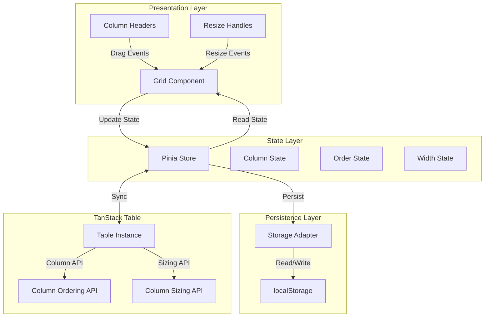
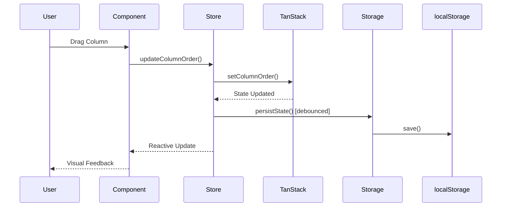

# Design Document: Column Management

## Overview

This design implements column reordering, resizing, and persistable grid state architecture for an enterprise data grid built with Vue 3, TanStack Table v8, and Quasar Framework. The solution provides a centralized state management approach using Pinia, integrates with TanStack Table's native column APIs, and persists user customizations to localStorage with a versioned schema.

The architecture separates concerns into three layers:
1. **Presentation Layer** - Vue components handling user interactions (drag/drop, resize)
2. **State Layer** - Pinia store managing grid state with reactive updates
3. **Persistence Layer** - localStorage adapter with serialization/deserialization

## Architecture

### High-Level Architecture



### State Flow



## Components and Interfaces

### 1. Pinia Store: `useGridStateStore`

The central state management store for all grid customizations.

**State:**
```typescript
interface GridState {
  // Map of grid ID to grid configuration
  grids: Record<string, GridConfig>
}

interface GridConfig {
  columnOrder: string[]        // Array of column IDs in display order
  columnWidths: Record<string, number>  // Map of column ID to width in pixels
  columnVisibility: Record<string, boolean>  // Map of column ID to visibility
  version: number              // Schema version for migrations
  lastUpdated: number          // Timestamp for cache invalidation
}
```

**Actions:**
```typescript
// Column Order Management
updateColumnOrder(gridId: string, columnOrder: string[]): void
moveColumn(gridId: string, columnId: string, toIndex: number): void

// Column Width Management
updateColumnWidth(gridId: string, columnId: string, width: number): void
updateColumnWidths(gridId: string, widths: Record<string, number>): void
autoFitColumn(gridId: string, columnId: string): void

// Column Visibility Management
updateColumnVisibility(gridId: string, columnId: string, visible: boolean): void

// State Lifecycle
initializeGrid(gridId: string, defaultConfig: GridConfig): void
resetGrid(gridId: string): void
exportGridState(gridId: string): string
importGridState(gridId: string, stateJson: string): void

// Persistence
persistState(gridId: string): void  // Debounced
loadState(gridId: string): GridConfig | null
```

**Getters:**
```typescript
getGridConfig(gridId: string): GridConfig | undefined
getColumnOrder(gridId: string): string[]
getColumnWidth(gridId: string, columnId: string): number | undefined
isColumnVisible(gridId: string, columnId: string): boolean
```

### 2. Storage Adapter: `GridStateStorage`

Handles serialization, deserialization, and localStorage interactions.

**Interface:**
```typescript
interface IGridStateStorage {
  save(gridId: string, config: GridConfig): void
  load(gridId: string): GridConfig | null
  remove(gridId: string): void
  clear(): void
  migrate(oldConfig: any, fromVersion: number, toVersion: number): GridConfig
}
```

**Implementation:**
```typescript
class GridStateStorage implements IGridStateStorage {
  private readonly STORAGE_PREFIX = 'grid_state_'
  private readonly CURRENT_VERSION = 1
  
  save(gridId: string, config: GridConfig): void {
    const key = this.getStorageKey(gridId)
    const serialized = JSON.stringify(config)
    localStorage.setItem(key, serialized)
  }
  
  load(gridId: string): GridConfig | null {
    const key = this.getStorageKey(gridId)
    const serialized = localStorage.getItem(key)
    
    if (!serialized) return null
    
    try {
      const config = JSON.parse(serialized)
      
      // Version migration
      if (config.version !== this.CURRENT_VERSION) {
        return this.migrate(config, config.version, this.CURRENT_VERSION)
      }
      
      return config
    } catch (error) {
      console.error('Failed to parse grid state:', error)
      return null
    }
  }
  
  remove(gridId: string): void {
    const key = this.getStorageKey(gridId)
    localStorage.removeItem(key)
  }
  
  clear(): void {
    const keys = Object.keys(localStorage)
    keys.forEach(key => {
      if (key.startsWith(this.STORAGE_PREFIX)) {
        localStorage.removeItem(key)
      }
    })
  }
  
  migrate(oldConfig: any, fromVersion: number, toVersion: number): GridConfig {
    // Migration logic for schema changes
    let config = oldConfig
    
    // Example: v0 -> v1 migration
    if (fromVersion === 0 && toVersion >= 1) {
      config = {
        ...config,
        version: 1,
        lastUpdated: Date.now()
      }
    }
    
    return config
  }
  
  private getStorageKey(gridId: string): string {
    return `${this.STORAGE_PREFIX}${gridId}`
  }
}
```

### 3. Column Reordering Composable: `useColumnReordering`

Handles drag-and-drop logic for column reordering.

**Interface:**
```typescript
interface UseColumnReorderingOptions {
  gridId: string
  tableInstance: Table<any>
  onOrderChange?: (newOrder: string[]) => void
}

interface UseColumnReorderingReturn {
  isDragging: Ref<boolean>
  draggedColumnId: Ref<string | null>
  dropIndicatorPosition: Ref<number | null>
  
  handleDragStart: (columnId: string, event: DragEvent) => void
  handleDragOver: (columnId: string, event: DragEvent) => void
  handleDragEnd: (event: DragEvent) => void
  handleDrop: (targetColumnId: string, event: DragEvent) => void
}
```

**Implementation Strategy:**
- Use HTML5 Drag and Drop API for mouse interactions
- Use touch events for mobile support
- Provide visual feedback with ghost image and drop indicators
- Validate drop positions (respect pinned columns)
- Update Pinia store on successful drop
- Sync with TanStack Table's `setColumnOrder()` API

### 4. Column Resizing Composable: `useColumnResizing`

Handles column width adjustments.

**Interface:**
```typescript
interface UseColumnResizingOptions {
  gridId: string
  tableInstance: Table<any>
  minWidth?: number  // Default: 50px
  maxWidth?: number  // Default: 1000px
  onWidthChange?: (columnId: string, width: number) => void
}

interface UseColumnResizingReturn {
  isResizing: Ref<boolean>
  resizingColumnId: Ref<string | null>
  
  handleResizeStart: (columnId: string, event: MouseEvent) => void
  handleResizeMove: (event: MouseEvent) => void
  handleResizeEnd: (event: MouseEvent) => void
  handleDoubleClick: (columnId: string) => void
  
  getColumnWidth: (columnId: string) => number
}
```

**Implementation Strategy:**
- Track mouse position during resize
- Calculate width delta and apply constraints
- Update width in real-time during drag
- Debounce store updates (every 100ms)
- Use TanStack Table's `setColumnSizing()` API
- Auto-fit calculates max content width in visible rows

### 5. Grid Component Integration

The main grid component integrates all composables and manages the overall state.

**Key Responsibilities:**
- Initialize grid state on mount
- Provide column header slots with drag/resize handlers
- Render drop indicators during drag operations
- Render resize handles on column borders
- Sync TanStack Table state with Pinia store
- Handle keyboard navigation for accessibility

**Component Structure:**
```vue
<template>
  <div class="enterprise-grid">
    <table>
      <thead>
        <tr>
          <th
            v-for="column in visibleColumns"
            :key="column.id"
            :style="{ width: getColumnWidth(column.id) + 'px' }"
            :draggable="!column.pinned"
            @dragstart="handleDragStart(column.id, $event)"
            @dragover="handleDragOver(column.id, $event)"
            @drop="handleDrop(column.id, $event)"
            @dragend="handleDragEnd"
          >
            <div class="column-header">
              <span>{{ column.header }}</span>
              <div
                class="resize-handle"
                @mousedown="handleResizeStart(column.id, $event)"
                @dblclick="handleDoubleClick(column.id)"
              />
            </div>
          </th>
        </tr>
      </thead>
      <tbody>
        <!-- Table rows -->
      </tbody>
    </table>
  </div>
</template>

<script setup lang="ts">
import { useGridStateStore } from '@/stores/gridState'
import { useColumnReordering } from '@/composables/useColumnReordering'
import { useColumnResizing } from '@/composables/useColumnResizing'

const props = defineProps<{
  gridId: string
  tableInstance: Table<any>
}>()

const store = useGridStateStore()

// Initialize grid state
onMounted(() => {
  store.initializeGrid(props.gridId, getDefaultConfig())
})

// Column reordering
const {
  isDragging,
  handleDragStart,
  handleDragOver,
  handleDrop,
  handleDragEnd
} = useColumnReordering({
  gridId: props.gridId,
  tableInstance: props.tableInstance
})

// Column resizing
const {
  isResizing,
  handleResizeStart,
  handleDoubleClick,
  getColumnWidth
} = useColumnResizing({
  gridId: props.gridId,
  tableInstance: props.tableInstance
})

// Computed properties
const visibleColumns = computed(() => {
  const order = store.getColumnOrder(props.gridId)
  return order
    .map(id => props.tableInstance.getColumn(id))
    .filter(col => col && store.isColumnVisible(props.gridId, col.id))
})
</script>
```

## Data Models

### GridConfig Schema

**Version 1 (Current):**
```typescript
interface GridConfigV1 {
  columnOrder: string[]
  columnWidths: Record<string, number>
  columnVisibility: Record<string, boolean>
  version: 1
  lastUpdated: number
}
```

**Serialized Example:**
```json
{
  "columnOrder": ["id", "name", "email", "status", "createdAt"],
  "columnWidths": {
    "id": 80,
    "name": 200,
    "email": 250,
    "status": 120,
    "createdAt": 180
  },
  "columnVisibility": {
    "id": true,
    "name": true,
    "email": true,
    "status": true,
    "createdAt": false
  },
  "version": 1,
  "lastUpdated": 1704067200000
}
```

### Column Metadata

Columns can define metadata for reordering and resizing behavior:

```typescript
interface ColumnMeta {
  pinned?: 'left' | 'right'  // Pinned columns have restricted reordering
  minWidth?: number           // Minimum width constraint
  maxWidth?: number           // Maximum width constraint
  resizable?: boolean         // Whether column can be resized
  reorderable?: boolean       // Whether column can be reordered
}
```

## Correctness Properties


*A property is a characteristic or behavior that should hold true across all valid executions of a system—essentially, a formal statement about what the system should do. Properties serve as the bridge between human-readable specifications and machine-verifiable correctness guarantees.*

### Property 1: Column reordering updates state correctly

*For any* column and any valid target position, completing a drag operation should update the column order in the state store to reflect the new position.

**Validates: Requirements 1.3**

### Property 2: Invalid drag operations preserve state

*For any* invalid drop position, completing a drag operation should leave the column order unchanged.

**Validates: Requirements 1.4**

### Property 3: Column order changes propagate to store

*For any* column order change, the state store should immediately reflect that change in the grid state.

**Validates: Requirements 1.5**

### Property 4: Pinned columns respect boundaries

*For any* pinned column, attempting to reorder it outside its pinned region (left or right) should either fail or restrict the move to within the pinned region.

**Validates: Requirements 1.6**

### Property 5: Touch and mouse equivalence

*For any* drag operation, performing it with touch input should produce the same column order result as performing it with mouse input.

**Validates: Requirements 1.7**

### Property 6: Resize operations update width in real-time

*For any* resize operation, the column width in the state should update continuously during the resize.

**Validates: Requirements 2.3**

### Property 7: Width constraints are enforced

*For any* column with minimum or maximum width constraints, attempting to resize outside those bounds should clamp the width to the nearest valid value.

**Validates: Requirements 2.4, 2.5**

### Property 8: Auto-fit adjusts width correctly

*For any* column, double-clicking the column border should trigger auto-fit and update the column width to match the content width.

**Validates: Requirements 2.6**

### Property 9: Width changes propagate to store

*For any* column width change, the state store should immediately reflect that change in the grid state.

**Validates: Requirements 2.7**

### Property 10: State changes persist to localStorage

*For any* grid state change, the persistence layer should serialize and save the state to localStorage (with debouncing).

**Validates: Requirements 3.1**

### Property 11: State persistence round-trip

*For any* valid grid state, saving it to localStorage and then loading it should produce an equivalent state with the same column order, widths, and visibility.

**Validates: Requirements 3.2, 3.4**

### Property 12: Grid isolation by ID

*For any* two different grid IDs, saving state for one grid should not affect the state of the other grid.

**Validates: Requirements 3.5**

### Property 13: Corrupted state fallback

*For any* corrupted or invalid JSON in localStorage, loading the state should fall back to the default state and log an error.

**Validates: Requirements 3.6**

### Property 14: Reset restores default state

*For any* grid with modified state, triggering a reset should restore the default state for column order, widths, and visibility, and clear the saved state from localStorage.

**Validates: Requirements 4.1, 4.2**

### Property 15: Export produces valid JSON

*For any* grid state, exporting should produce a valid JSON string that can be parsed back into an equivalent state object.

**Validates: Requirements 5.1**

### Property 16: Import/export round-trip

*For any* valid grid state, exporting then importing should produce an equivalent state.

**Validates: Requirements 5.2**

### Property 17: Invalid import rejection

*For any* invalid JSON input, attempting to import should reject the import and display an error message without modifying the current state.

**Validates: Requirements 5.3**

### Property 18: Imported state persists

*For any* successfully imported state, the persistence layer should save it to localStorage.

**Validates: Requirements 5.4**

### Property 19: State updates are reactive

*For any* state change in the store, all subscribed grid components should receive the update reactively.

**Validates: Requirements 6.2**

### Property 20: Schema migration preserves data

*For any* old version state, migrating to the new schema version should produce a valid new version state with all data preserved.

**Validates: Requirements 6.5**

### Property 21: localStorage writes are debounced

*For any* sequence of rapid state changes, the number of localStorage write operations should be significantly fewer than the number of state changes.

**Validates: Requirements 6.6**

### Property 22: Reordering preserves visibility

*For any* column order change, the visibility settings for all columns should remain unchanged.

**Validates: Requirements 7.1**

### Property 23: Visibility changes preserve order and width

*For any* column visibility change, the column order and widths should remain unchanged.

**Validates: Requirements 7.2**

### Property 24: Hidden columns excluded from visible order

*For any* hidden column, it should not appear in the visible column order or be rendered in the grid.

**Validates: Requirements 7.3**

### Property 25: Row expand state preserved during column operations

*For any* row with expand/collapse state, performing column reordering or resizing should not affect the row's expand/collapse state.

**Validates: Requirements 7.5**

### Property 26: Edit state preserved during column operations

*For any* cell in edit mode, performing column reordering or resizing should not affect the edit state or lose unsaved changes.

**Validates: Requirements 7.6**

### Property 27: Keyboard reordering moves columns correctly

*For any* column with keyboard focus, pressing left/right arrow keys should move the column in the corresponding direction by one position.

**Validates: Requirements 8.2**

### Property 28: Keyboard resizing adjusts width incrementally

*For any* column border with keyboard focus, pressing left/right arrow keys should adjust the column width by a fixed increment (e.g., 10px).

**Validates: Requirements 8.4**

### Property 29: Resize events are debounced

*For any* sequence of rapid resize events, the number of state updates should be significantly fewer than the number of resize events.

**Validates: Requirements 9.1**

## Error Handling

### Persistence Errors

**Corrupted localStorage data:**
- Catch JSON parse errors during deserialization
- Log error with details for debugging
- Fall back to default state
- Clear corrupted data from localStorage

**localStorage quota exceeded:**
- Catch QuotaExceededError during save
- Log error with current state size
- Notify user with error message
- Optionally compress state or remove old entries

**Missing grid configuration:**
- Check if grid ID exists in store
- Return default configuration if missing
- Initialize store with default on first access

### Drag and Drop Errors

**Invalid drop target:**
- Validate drop position before applying
- Check pinned column constraints
- Return column to original position if invalid
- Provide visual feedback (e.g., red drop indicator)

**Drag operation interrupted:**
- Handle dragend event even if drop didn't occur
- Clean up drag state (isDragging, draggedColumnId)
- Reset visual feedback elements

### Resize Errors

**Invalid width values:**
- Validate width is a positive number
- Clamp to min/max constraints
- Default to previous width if invalid

**Resize operation interrupted:**
- Handle mouseup event globally (not just on resize handle)
- Clean up resize state (isResizing, resizingColumnId)
- Ensure final width is persisted

### Import/Export Errors

**Invalid JSON format:**
- Catch JSON parse errors
- Display user-friendly error message
- Preserve current state (don't modify)

**Schema version mismatch:**
- Check version field in imported state
- Attempt migration if possible
- Reject import if migration fails
- Display error with version details

**Missing required fields:**
- Validate imported state has columnOrder, columnWidths, columnVisibility
- Reject import if required fields missing
- Display error listing missing fields

## Testing Strategy

### Dual Testing Approach

This feature requires both **unit tests** and **property-based tests** for comprehensive coverage:

- **Unit tests** verify specific examples, edge cases, and error conditions
- **Property tests** verify universal properties across all inputs
- Both are complementary and necessary

### Unit Testing

Unit tests should focus on:

1. **Specific examples:**
   - Dragging column from position 0 to position 2
   - Resizing column from 100px to 200px
   - Hiding a visible column
   - Showing a hidden column

2. **Edge cases:**
   - Empty grid state (no columns)
   - Single column grid
   - All columns hidden
   - Grid with only pinned columns
   - localStorage empty on mount
   - localStorage contains corrupted data

3. **Error conditions:**
   - Invalid JSON import
   - localStorage quota exceeded
   - Drag to invalid position
   - Resize below minimum width
   - Resize above maximum width

4. **Integration points:**
   - Pinia store initialization
   - TanStack Table API calls
   - localStorage read/write operations
   - Component lifecycle hooks

### Property-Based Testing

Property tests should verify universal correctness properties using a property-based testing library (e.g., **fast-check** for TypeScript/JavaScript).

**Configuration:**
- Minimum **100 iterations** per property test
- Each test must reference its design document property
- Tag format: `Feature: column-management, Property {number}: {property_text}`

**Test Implementation Pattern:**

```typescript
import fc from 'fast-check'

// Feature: column-management, Property 11: State persistence round-trip
test('state persistence round-trip', () => {
  fc.assert(
    fc.property(
      fc.record({
        columnOrder: fc.array(fc.string(), { minLength: 1 }),
        columnWidths: fc.dictionary(fc.string(), fc.integer({ min: 50, max: 1000 })),
        columnVisibility: fc.dictionary(fc.string(), fc.boolean()),
        version: fc.constant(1),
        lastUpdated: fc.integer({ min: 0 })
      }),
      (gridState) => {
        const storage = new GridStateStorage()
        const gridId = 'test-grid'
        
        // Save state
        storage.save(gridId, gridState)
        
        // Load state
        const loaded = storage.load(gridId)
        
        // Assert equivalence
        expect(loaded).toEqual(gridState)
      }
    ),
    { numRuns: 100 }
  )
})
```

**Property Test Coverage:**

Each of the 29 correctness properties should have a corresponding property-based test:

1. Property 1: Generate random columns and target positions, verify order updates
2. Property 2: Generate invalid positions, verify order unchanged
3. Property 3: Generate order changes, verify store updates
4. Property 4: Generate pinned columns and out-of-bounds moves, verify restrictions
5. Property 5: Generate drag operations, verify touch/mouse equivalence
6. Property 6: Generate resize operations, verify real-time updates
7. Property 7: Generate widths outside constraints, verify clamping
8. Property 8: Generate columns, verify auto-fit calculates correct width
9. Property 9: Generate width changes, verify store updates
10. Property 10: Generate state changes, verify localStorage writes
11. Property 11: Generate states, verify save/load round-trip
12. Property 12: Generate multiple grid IDs, verify isolation
13. Property 13: Generate corrupted JSON, verify fallback
14. Property 14: Generate modified states, verify reset
15. Property 15: Generate states, verify export produces valid JSON
16. Property 16: Generate states, verify export/import round-trip
17. Property 17: Generate invalid JSON, verify rejection
18. Property 18: Generate imported states, verify persistence
19. Property 19: Generate state changes, verify reactive updates
20. Property 20: Generate old version states, verify migration
21. Property 21: Generate rapid state changes, verify debouncing
22. Property 22: Generate order changes, verify visibility preserved
23. Property 23: Generate visibility changes, verify order/width preserved
24. Property 24: Generate hidden columns, verify exclusion
25. Property 25: Generate row states and column operations, verify preservation
26. Property 26: Generate edit states and column operations, verify preservation
27. Property 27: Generate keyboard events, verify column movement
28. Property 28: Generate keyboard events, verify width adjustment
29. Property 29: Generate rapid resize events, verify debouncing

### Test Organization

```
tests/
├── unit/
│   ├── stores/
│   │   └── gridState.spec.ts
│   ├── composables/
│   │   ├── useColumnReordering.spec.ts
│   │   └── useColumnResizing.spec.ts
│   ├── utils/
│   │   └── GridStateStorage.spec.ts
│   └── components/
│       └── EnterpriseGrid.spec.ts
└── property/
    ├── columnReordering.property.spec.ts
    ├── columnResizing.property.spec.ts
    ├── statePersistence.property.spec.ts
    └── stateIntegrity.property.spec.ts
```

### Testing Tools

- **Unit Testing:** Vitest + Vue Test Utils
- **Property Testing:** fast-check
- **Component Testing:** Vitest + @vue/test-utils
- **E2E Testing:** Playwright (optional, for full user flows)

### Mocking Strategy

- Mock localStorage for unit tests (use in-memory implementation)
- Mock TanStack Table instance for composable tests
- Use real Pinia store with test utilities for integration tests
- Generate random test data with fast-check for property tests
