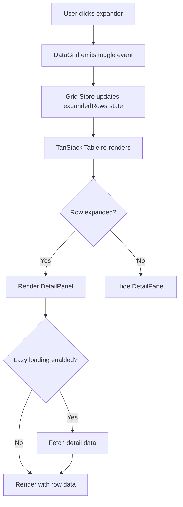

# Design Document: Expandable Rows / Nested Detail Panels

## Overview

This design extends the existing enterprise data grid to support expandable rows with nested detail panels. The implementation leverages TanStack Table's built-in row expansion API, integrates with the existing Pinia store for state management, and provides a flexible, config-driven approach that maintains consistency with the current architecture.

The design prioritizes:
- **Minimal API surface**: Single `expandable` prop configuration
- **Flexibility**: Slot-based and component-based detail renderers
- **Performance**: Lazy loading and virtualization compatibility
- **Consistency**: Follows existing patterns for permissions, state management, and configuration

## Architecture

### High-Level Component Structure

```
DataGrid.vue (Enhanced)
├── Row Expander Column (new)
│   └── ExpanderCell.vue (new)
├── Regular Data Columns (existing)
└── Expanded Row Detail (new)
    └── DetailPanel.vue (new)
        └── User-provided Detail Renderer (slot/component)
```

### State Management Flow



### Integration Points

1. **TanStack Table**: Use `getExpandedRowModel()` and row expansion API
2. **Pinia Store**: Extend `useGridStore` with expansion state management
3. **Type System**: Extend `types.ts` with expandable configuration types
4. **Permission System**: Reuse existing `requiredPermissions` pattern

## Components and Interfaces

### 1. Type Definitions (types.ts)

```typescript
// Expandable row configuration
export interface ExpandableConfig<TData = any> {
  // Renderer configuration (slot name or component)
  renderer?: string | Component;
  
  // Lazy loading function
  lazyLoad?: (row: TData, rowId: string) => Promise<any>;
  
  // Initially expanded row IDs
  defaultExpanded?: string[];
  
  // Only allow one row expanded at a time
  singleExpand?: boolean;
  
  // Required permissions to expand rows
  requiredPermissions?: string[];
  
  // Custom row expansion check (e.g., only expand rows with children)
  canExpand?: (row: TData) => boolean;
}

// Detail panel data state
export interface DetailPanelState {
  [rowId: string]: {
    data: any;
    loading: boolean;
    error: string | null;
  };
}

// Extended DataResult to include expandable config
export interface DataResult {
  primaryKey: string;
  columns: ColumnConfig[];
  rows: DataRow[];
  pagination?: {
    pageIndex: number;
    pageSize: number;
    totalRows: number;
  };
  expandable?: ExpandableConfig; // New property
}
```

### 2. Grid Store Extensions (store.ts)

```typescript
// Add to useGridStore
export const useGridStore = defineStore('grid', () => {
  // ... existing state ...
  
  // Expansion state
  const expandedRows = ref<Record<string, boolean>>({});
  const detailPanelData = ref<DetailPanelState>({});
  
  // Computed
  const expandedRowIds = computed(() => 
    Object.keys(expandedRows.value).filter(id => expandedRows.value[id])
  );
  
  // Actions
  const expandRow = (rowId: string) => {
    expandedRows.value[rowId] = true;
  };
  
  const collapseRow = (rowId: string) => {
    expandedRows.value[rowId] = false;
  };
  
  const toggleRowExpansion = (rowId: string) => {
    expandedRows.value[rowId] = !expandedRows.value[rowId];
  };
  
  const expandAllRows = (rowIds: string[]) => {
    rowIds.forEach(id => {
      expandedRows.value[id] = true;
    });
  };
  
  const collapseAllRows = () => {
    expandedRows.value = {};
  };
  
  const setDetailPanelData = (rowId: string, data: any) => {
    detailPanelData.value[rowId] = {
      data,
      loading: false,
      error: null,
    };
  };
  
  const setDetailPanelLoading = (rowId: string, loading: boolean) => {
    if (!detailPanelData.value[rowId]) {
      detailPanelData.value[rowId] = { data: null, loading, error: null };
    } else {
      detailPanelData.value[rowId].loading = loading;
    }
  };
  
  const setDetailPanelError = (rowId: string, error: string) => {
    if (!detailPanelData.value[rowId]) {
      detailPanelData.value[rowId] = { data: null, loading: false, error };
    } else {
      detailPanelData.value[rowId].error = error;
    }
  };
  
  const cleanupExpandedRows = (validRowIds: string[]) => {
    const validSet = new Set(validRowIds);
    Object.keys(expandedRows.value).forEach(id => {
      if (!validSet.has(id)) {
        delete expandedRows.value[id];
        delete detailPanelData.value[id];
      }
    });
  };
  
  return {
    // ... existing exports ...
    expandedRows,
    detailPanelData,
    expandedRowIds,
    expandRow,
    collapseRow,
    toggleRowExpansion,
    expandAllRows,
    collapseAllRows,
    setDetailPanelData,
    setDetailPanelLoading,
    setDetailPanelError,
    cleanupExpandedRows,
  };
});
```

### 3. ExpanderCell Component

```vue
<!-- components/grid/cells/ExpanderCell.vue -->
<template>
  <button
    v-if="canExpand"
    @click="handleToggle"
    @keydown.enter.prevent="handleToggle"
    @keydown.space.prevent="handleToggle"
    class="expander-button"
    :aria-expanded="isExpanded"
    :aria-label="isExpanded ? 'Collapse row' : 'Expand row'"
    type="button"
  >
    <q-icon 
      :name="isExpanded ? 'expand_more' : 'chevron_right'" 
      size="sm"
      class="transition-transform"
    />
  </button>
  <span v-else class="expander-placeholder"></span>
</template>

<script setup lang="ts">
import { computed } from 'vue';
import { useGridStore } from '@/lib/grid/store';

const props = defineProps<{
  rowId: string;
  canExpand: boolean;
}>();

const emit = defineEmits<{
  toggle: [rowId: string];
}>();

const gridStore = useGridStore();

const isExpanded = computed(() => 
  gridStore.expandedRows[props.rowId] || false
);

const handleToggle = () => {
  emit('toggle', props.rowId);
};
</script>

<style scoped>
.expander-button {
  padding: 4px;
  border: none;
  background: transparent;
  cursor: pointer;
  display: flex;
  align-items: center;
  justify-content: center;
  border-radius: 4px;
  transition: background-color 0.2s;
}

.expander-button:hover {
  background-color: rgba(0, 0, 0, 0.05);
}

.expander-button:focus-visible {
  outline: 2px solid var(--q-primary);
  outline-offset: 2px;
}

.expander-placeholder {
  display: inline-block;
  width: 24px;
}
</style>
```

### 4. DetailPanel Component

```vue
<!-- components/grid/cells/DetailPanel.vue -->
<template>
  <tr class="detail-panel-row">
    <td :colspan="columnCount" class="detail-panel-cell">
      <div 
        class="detail-panel-content"
        role="region"
        :aria-labelledby="`row-${rowId}`"
      >
        <!-- Loading State -->
        <div v-if="isLoading" class="detail-panel-loading">
          <q-spinner-dots size="40px" color="primary" />
          <span class="text-sm text-gray-600 mt-2">Loading details...</span>
        </div>
        
        <!-- Error State -->
        <div v-else-if="error" class="detail-panel-error">
          <q-icon name="error" size="md" color="negative" />
          <span class="text-sm text-negative">{{ error }}</span>
          <q-btn 
            flat 
            size="sm" 
            label="Retry" 
            @click="handleRetry"
            class="mt-2"
          />
        </div>
        
        <!-- Content -->
        <div v-else class="detail-panel-inner">
          <!-- Slot-based renderer -->
          <slot 
            v-if="!rendererComponent"
            :row="row" 
            :rowId="rowId" 
            :data="detailData"
          />
          
          <!-- Component-based renderer -->
          <component
            v-else
            :is="rendererComponent"
            :row="row"
            :rowId="rowId"
            :data="detailData"
          />
        </div>
      </div>
    </td>
  </tr>
</template>

<script setup lang="ts">
import { computed, onMounted, ref } from 'vue';
import { useGridStore } from '@/lib/grid/store';
import type { ExpandableConfig } from '@/lib/grid/types';

const props = defineProps<{
  row: any;
  rowId: string;
  columnCount: number;
  expandableConfig: ExpandableConfig;
}>();

const emit = defineEmits<{
  retry: [rowId: string];
}>();

const gridStore = useGridStore();

const rendererComponent = computed(() => {
  const renderer = props.expandableConfig.renderer;
  return typeof renderer === 'string' ? null : renderer;
});

const detailPanelState = computed(() => 
  gridStore.detailPanelData[props.rowId]
);

const isLoading = computed(() => 
  detailPanelState.value?.loading || false
);

const error = computed(() => 
  detailPanelState.value?.error || null
);

const detailData = computed(() => 
  detailPanelState.value?.data || null
);

const handleRetry = () => {
  emit('retry', props.rowId);
};

// Load data on mount if lazy loading is configured
onMounted(async () => {
  if (props.expandableConfig.lazyLoad && !detailPanelState.value) {
    gridStore.setDetailPanelLoading(props.rowId, true);
    try {
      const data = await props.expandableConfig.lazyLoad(props.row, props.rowId);
      gridStore.setDetailPanelData(props.rowId, data);
    } catch (err) {
      gridStore.setDetailPanelError(
        props.rowId, 
        err instanceof Error ? err.message : 'Failed to load detail data'
      );
    }
  }
});
</script>

<style scoped>
.detail-panel-row {
  background-color: #f9fafb;
}

.detail-panel-cell {
  padding: 0 !important;
  border-bottom: 2px solid #e5e7eb;
}

.detail-panel-content {
  animation: slideDown 0.2s ease-out;
  overflow: hidden;
}

@keyframes slideDown {
  from {
    opacity: 0;
    max-height: 0;
  }
  to {
    opacity: 1;
    max-height: 500px;
  }
}

.detail-panel-loading,
.detail-panel-error {
  display: flex;
  flex-direction: column;
  align-items: center;
  justify-content: center;
  padding: 2rem;
}

.detail-panel-inner {
  padding: 1rem;
}
</style>
```

### 5. DataGrid Component Modifications

Key changes to `DataGrid.vue`:

1. **Add expander column to column definitions**:
```typescript
const columns = computed<ColumnDef<any>[]>(() => {
  if (!props.data?.columns) return [];
  
  const cols: ColumnDef<any>[] = [];
  
  // Add expander column if expandable config exists
  if (props.data.expandable && hasExpandPermission.value) {
    cols.push({
      id: "expander",
      header: "",
      cell: ({ row }) => row.original,
      enableSorting: false,
      enableHiding: false,
      size: 50,
      minSize: 50,
      maxSize: 50,
    });
  }
  
  // Add selection column
  cols.push(selectColumn);
  
  // Add data columns
  cols.push(...dataColumns);
  
  return cols;
});
```

2. **Add expansion state to table configuration**:
```typescript
const table = useVueTable({
  // ... existing config ...
  state: {
    // ... existing state ...
    get expanded() {
      return expandedRows.value;
    },
  },
  onExpandedChange: (updater) => {
    // Handle expansion state changes
    if (typeof updater === 'function') {
      const newState = updater(expandedRows.value);
      Object.keys(newState).forEach(rowId => {
        if (newState[rowId]) {
          gridStore.expandRow(rowId);
        } else {
          gridStore.collapseRow(rowId);
        }
      });
    }
  },
  getExpandedRowModel: getExpandedRowModel(),
  enableExpanding: true,
});
```

3. **Render expander cells and detail panels in template**:
```vue
<tbody class="bg-white divide-y divide-gray-200">
  <template v-for="row in table.getRowModel().rows" :key="row.id">
    <!-- Main Row -->
    <tr :class="getRowClass(row)">
      <td v-for="cell in row.getVisibleCells()" :key="cell.id">
        <!-- Expander Cell -->
        <ExpanderCell
          v-if="cell.column.id === 'expander'"
          :row-id="row.original.id"
          :can-expand="canExpandRow(row)"
          @toggle="handleToggleExpansion"
        />
        
        <!-- Selection Cell -->
        <q-checkbox
          v-else-if="cell.column.id === 'select'"
          :model-value="row.getIsSelected()"
          @update:model-value="row.toggleSelected"
        />
        
        <!-- Regular Cell -->
        <EditableCell
          v-else
          :value="cell.getValue()"
          :row-id="row.original.id"
          :column="getColumnConfig(cell.column.id)"
        />
      </td>
    </tr>
    
    <!-- Detail Panel Row -->
    <DetailPanel
      v-if="row.getIsExpanded()"
      :row="row.original"
      :row-id="row.original.id"
      :column-count="row.getVisibleCells().length"
      :expandable-config="props.data.expandable"
      @retry="handleRetryDetailLoad"
    >
      <!-- Pass through slot content -->
      <template #default="slotProps">
        <slot name="detail-panel" v-bind="slotProps" />
      </template>
    </DetailPanel>
  </template>
</tbody>
```

## Data Models

### Expansion State Structure

```typescript
// In Grid Store
expandedRows: {
  "employee-123": true,
  "employee-456": true,
  // ... other expanded row IDs
}

detailPanelData: {
  "employee-123": {
    data: { /* fetched detail data */ },
    loading: false,
    error: null
  },
  "employee-456": {
    data: null,
    loading: true,
    error: null
  }
}
```

### Configuration Example

```typescript
// In Dashboard.vue or parent component
const expandableConfig: ExpandableConfig = {
  renderer: EmployeeDetailPanel, // Component
  // OR
  renderer: 'detail-panel', // Slot name
  
  lazyLoad: async (row, rowId) => {
    const response = await fetch(`/api/employees/${rowId}/details`);
    return response.json();
  },
  
  defaultExpanded: ['employee-123'],
  
  singleExpand: false,
  
  requiredPermissions: ['admin', 'editor'],
  
  canExpand: (row) => row.hasDetails === true,
};
```


## Correctness Properties

A property is a characteristic or behavior that should hold true across all valid executions of a system—essentially, a formal statement about what the system should do. Properties serve as the bridge between human-readable specifications and machine-verifiable correctness guarantees.

### Property 1: Expander Column Visibility

*For any* grid configuration, when the `expandable` prop is defined and the user has required permissions, the grid should render an expander column as the leftmost column; when the `expandable` prop is undefined or the user lacks permissions, no expander column should be rendered.

**Validates: Requirements 1.1, 5.2, 6.2**

### Property 2: Expansion State Toggle

*For any* row with an expander, clicking the expander button should toggle the row's expansion state in the Grid_Store (from expanded to collapsed or vice versa).

**Validates: Requirements 1.2, 3.2, 3.3**

### Property 3: Detail Panel Visibility

*For any* row, the Detail_Panel should be present in the DOM if and only if the row's ID is in the Expand_State with a value of true.

**Validates: Requirements 1.3, 1.4**

### Property 4: Expander Icon State

*For any* row with an expander, the icon should display a right-pointing chevron when the row is collapsed and a down-pointing chevron when the row is expanded.

**Validates: Requirements 1.5**

### Property 5: Expanded Row Visual Indicator

*For any* expanded row, the row element should have a visual indicator (CSS class or style) that distinguishes it from collapsed rows.

**Validates: Requirements 1.6**

### Property 6: Detail Renderer Props

*For any* rendered Detail_Panel, the renderer should receive the complete row data, row ID, and row index as props.

**Validates: Requirements 2.3, 2.4**

### Property 7: Detail Panel Colspan

*For any* rendered Detail_Panel, the colspan attribute should equal the total number of visible columns in the grid.

**Validates: Requirements 2.5**

### Property 8: Expand State Persistence Across Pagination

*For any* set of expanded rows, changing the page index should preserve the Expand_State, such that rows with IDs in the Expand_State remain expanded when they appear on a different page.

**Validates: Requirements 3.4**

### Property 9: Expand State Persistence Across Sorting

*For any* set of expanded rows, changing the sort order should preserve the Expand_State, such that all previously expanded rows remain expanded after sorting.

**Validates: Requirements 3.5**

### Property 10: Expand State Persistence Across Filtering

*For any* set of expanded rows, applying filters should preserve the Expand_State for rows that remain visible after filtering.

**Validates: Requirements 3.6**

### Property 11: Expand State Cleanup

*For any* row ID in the Expand_State, if that row ID is no longer present in the current dataset, the Grid should remove it from the Expand_State.

**Validates: Requirements 3.7**

### Property 12: Lazy Load Invocation

*For any* row with lazy loading enabled, expanding the row for the first time should invoke the lazyLoad callback function with the row data and row ID as parameters.

**Validates: Requirements 4.2, 4.6**

### Property 13: Loading Indicator Display

*For any* Detail_Panel with data currently loading, the panel should display a loading indicator in the DOM.

**Validates: Requirements 4.3**

### Property 14: Error Display and Retry

*For any* Detail_Panel where data loading failed, the panel should display an error message and a retry button in the DOM.

**Validates: Requirements 4.4**

### Property 15: Lazy Load Caching

*For any* row with lazy loading enabled, expanding the row, collapsing it, and expanding it again should only invoke the lazyLoad callback once (data should be cached).

**Validates: Requirements 4.5**

### Property 16: Default Expanded State

*For any* row ID specified in the `defaultExpanded` configuration array, that row should be in the Expand_State with a value of true on initial grid render.

**Validates: Requirements 5.5**

### Property 17: Single Expand Mode

*For any* grid with `singleExpand` enabled, expanding a row should collapse all other currently expanded rows, such that at most one row is expanded at any time.

**Validates: Requirements 5.6, 5.7**

### Property 18: Permission-Based Programmatic Expansion

*For any* user lacking the required permissions specified in `requiredPermissions`, calling store actions to expand rows should have no effect on the Expand_State.

**Validates: Requirements 6.3**

### Property 19: Keyboard Toggle

*For any* focused row with an expander, pressing Enter or Space should toggle the row's expansion state.

**Validates: Requirements 7.1, 7.2**

### Property 20: Directional Keyboard Navigation

*For any* focused row with an expander, pressing Right Arrow on a collapsed row should expand it, and pressing Left Arrow on an expanded row should collapse it.

**Validates: Requirements 7.3, 7.4**

### Property 21: Tab Navigation in Detail Panel

*For any* expanded Detail_Panel containing focusable elements, pressing Tab should move focus to the next focusable element within the panel, following standard DOM focus order.

**Validates: Requirements 7.5**

### Property 22: Aria-Expanded Attribute

*For any* expander button, the `aria-expanded` attribute value should be "true" when the row is expanded and "false" when the row is collapsed.

**Validates: Requirements 8.1**

### Property 23: Aria-Label on Expander

*For any* expander button, the element should have an `aria-label` attribute that describes the expand/collapse action.

**Validates: Requirements 8.2**

### Property 24: Detail Panel Aria Attributes

*For any* rendered Detail_Panel, the panel element should have both `aria-labelledby` (referencing the parent row) and `role="region"` attributes.

**Validates: Requirements 8.3, 8.4**

### Property 25: Aria-Live Announcements

*For any* row expansion state change, the grid should update an aria-live region to announce the change to screen readers.

**Validates: Requirements 8.5**

### Property 26: Dynamic Row Height

*For any* row, the calculated row height should increase when the row is expanded to accommodate the Detail_Panel content.

**Validates: Requirements 9.1**

### Property 27: Virtualized Detail Panel Rendering

*For any* grid with virtualization enabled, Detail_Panels should only be rendered for rows currently in the viewport, not for off-screen rows.

**Validates: Requirements 9.2**

### Property 28: Detail Panel Lifecycle with Scrolling

*For any* expanded row with virtualization enabled, scrolling the row out of the viewport should unmount the Detail_Panel, and scrolling it back into the viewport should remount it.

**Validates: Requirements 9.3**

### Property 29: Expand All Rows

*For any* grid, calling `expandAllRows` with an array of row IDs should add all those IDs to the Expand_State with a value of true.

**Validates: Requirements 10.4**

### Property 30: Collapse All Rows

*For any* grid with expanded rows, calling `collapseAllRows` should clear the Expand_State, resulting in no rows being expanded.

**Validates: Requirements 10.5**

### Property 31: Expanded Row IDs Computed Property

*For any* Expand_State, the `expandedRowIds` computed property should return an array containing exactly the row IDs that have a value of true in the Expand_State.

**Validates: Requirements 10.6**

## Error Handling

### Lazy Loading Errors

- **Timeout Handling**: If a lazy load request exceeds a reasonable timeout (e.g., 30 seconds), treat it as a failure
- **Network Errors**: Catch and display user-friendly error messages for network failures
- **Retry Logic**: Provide a retry button that re-invokes the lazyLoad callback
- **Error State Persistence**: Store error state in `detailPanelData` to prevent repeated failed requests

### Invalid Configuration

- **Missing Renderer**: If `expandable.renderer` is undefined, log a warning and render a default "No renderer configured" message
- **Invalid Row IDs**: If `defaultExpanded` contains IDs not in the dataset, silently ignore them
- **Permission Validation**: If `requiredPermissions` is not an array, treat it as no permissions required

### State Cleanup

- **Pagination Changes**: Clean up Expand_State for rows no longer in the dataset
- **Data Refresh**: When data is refetched, validate all expanded row IDs still exist
- **Memory Leaks**: Ensure Detail_Panel components are properly unmounted when rows are collapsed or removed

### Edge Cases

- **Empty Dataset**: When no rows exist, Expand_State should be empty
- **Single Row**: Expansion should work correctly with only one row
- **All Rows Expanded**: Grid should handle all rows being expanded simultaneously
- **Rapid Toggle**: Debounce or handle rapid expansion/collapse clicks gracefully

## Testing Strategy

### Unit Tests

Unit tests should focus on specific examples, edge cases, and integration points:

1. **Component Rendering**:
   - ExpanderCell renders with correct icon based on state
   - DetailPanel renders loading, error, and content states
   - DataGrid includes expander column when configured

2. **Store Actions**:
   - `expandRow`, `collapseRow`, `toggleRowExpansion` update state correctly
   - `expandAllRows` and `collapseAllRows` handle multiple rows
   - `cleanupExpandedRows` removes invalid IDs

3. **Edge Cases**:
   - Empty dataset with expandable config
   - Single row expansion
   - Rapid toggle clicks
   - Invalid row IDs in defaultExpanded

4. **Error Handling**:
   - Lazy load timeout
   - Lazy load network error
   - Missing renderer configuration
   - Invalid permission configuration

5. **Integration**:
   - Expander column integrates with TanStack Table
   - Detail panel integrates with Quasar components
   - Permission system integration

### Property-Based Tests

Property-based tests should verify universal properties across randomized inputs. Each test should run a minimum of 100 iterations.

**Test Configuration**:
- Use `@fast-check/vitest` for property-based testing in Vitest
- Minimum 100 iterations per property test
- Tag each test with: `Feature: expandable-rows, Property {N}: {property_text}`

**Property Test Examples**:

1. **Property 2: Expansion State Toggle**
   - Generate: Random row data and initial expansion state
   - Action: Toggle expansion
   - Assert: State changes from expanded to collapsed or vice versa

2. **Property 3: Detail Panel Visibility**
   - Generate: Random set of expanded row IDs
   - Assert: Detail panels exist in DOM for expanded IDs only

3. **Property 8: Expand State Persistence Across Pagination**
   - Generate: Random expanded rows and page indices
   - Action: Change page
   - Assert: Expanded state preserved for rows on new page

4. **Property 15: Lazy Load Caching**
   - Generate: Random row data
   - Action: Expand, collapse, expand same row
   - Assert: Lazy load callback invoked exactly once

5. **Property 17: Single Expand Mode**
   - Generate: Random set of rows
   - Action: Expand multiple rows sequentially with singleExpand enabled
   - Assert: Only the most recently expanded row remains expanded

6. **Property 31: Expanded Row IDs Computed Property**
   - Generate: Random Expand_State object
   - Assert: expandedRowIds array contains exactly the IDs with value true

**Generators**:
- Row data: Objects with random IDs and properties
- Expansion state: Objects mapping row IDs to boolean values
- Configuration: Random expandable config with various options
- User roles: Random selection from admin/editor/viewer

**Invariants to Test**:
- Expand_State always contains valid row IDs from current dataset
- At most one row expanded when singleExpand is true
- Detail panel count equals number of true values in Expand_State
- Lazy load callback invoked at most once per row ID

### Testing Tools

- **Unit Testing**: Vitest with Vue Test Utils
- **Property-Based Testing**: @fast-check/vitest
- **Component Testing**: @vue/test-utils for component mounting
- **Store Testing**: Pinia testing utilities
- **Accessibility Testing**: @testing-library/vue with jest-axe

### Test Coverage Goals

- **Unit Test Coverage**: 80%+ line coverage for new components
- **Property Test Coverage**: All 31 correctness properties implemented
- **Integration Test Coverage**: Key user workflows (expand, lazy load, permissions)
- **Accessibility Test Coverage**: All ARIA requirements validated
