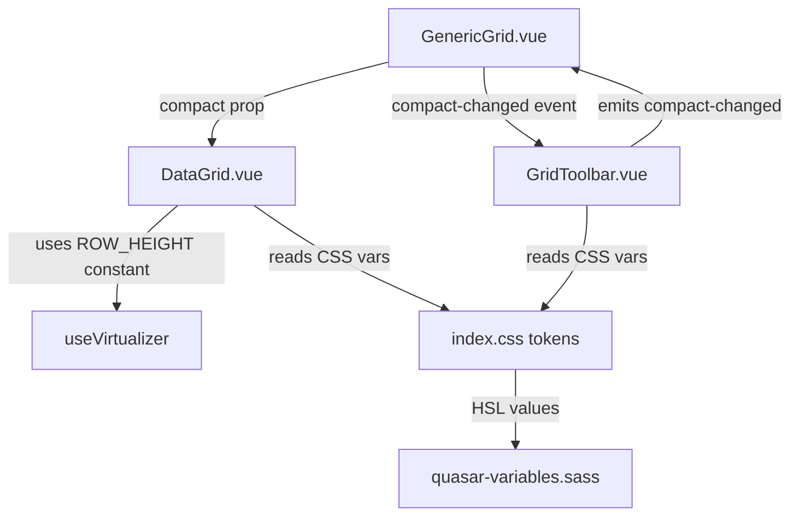
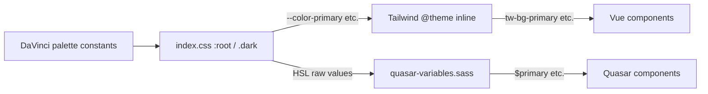

# Design Document

## Feature: responsive-daVinci-theme-compact-table

---

## Overview

This feature delivers three coordinated improvements to the DataGrid/GenericGrid UI:

1. **Responsive Layout** — horizontal overflow is contained within the `Table_Container` scroll context; the toolbar reflows gracefully at narrow viewports using flex-wrap and container queries.
2. **DaVinci Theme Alignment** — the existing Enterprise Slate HSL token set in `index.css` is replaced with DaVinci design-system tokens; `quasar-variables.sass` is updated to match; dark-mode support is preserved.
3. **Compact Table Layout** — a `compact` boolean prop on `DataGrid` switches row height from 53 px to 36 px, tightens cell padding, and reduces font size; the `GridToolbar` exposes a toggle that propagates the value through `GenericGrid`.

All three areas share a single constraint: **no hex or HSL color literals may appear in Vue component files**. Every color must be consumed via a CSS variable token.

---

## Architecture

### Component Interaction



### Token Flow



The DaVinci palette constants are defined as comments/SASS variables in `quasar-variables.sass` and mirrored as HSL values in `index.css`. This ensures a single palette drives both systems.

---

## Components and Interfaces

### DataGrid.vue — changes

| Change | Detail |
|---|---|
| New prop `compact: boolean` | Defaults to `false`; activates Compact_Mode |
| Row height constants | `ROW_HEIGHT_DEFAULT = 53`, `ROW_HEIGHT_COMPACT = 36` exported from a shared constants file |
| Virtualizer re-init | `watch(compact, ...)` triggers virtualizer re-creation with updated `estimateSize` |
| Dynamic cell classes | Computed class object switches between default and compact padding/font-size classes |
| Status bar label | Displays "Compact" or "Standard" alongside total row count |
| Header token classes | Replace hardcoded `bg-gray-50`, `text-gray-500` etc. with CSS-variable-backed Tailwind tokens |
| Skeleton row height | Skeleton `<tr>` style uses the same row-height constant |

### GridToolbar.vue — changes

| Change | Detail |
|---|---|
| New prop `compact: boolean` | Reflects current compact state for toggle button appearance |
| New emit `compact-changed` | Emits `boolean` when toggle is clicked |
| Flex-wrap layout | Root `<div>` gains `flex-wrap: wrap` and `container-type: inline-size` |
| Responsive label hiding | Icon-button labels hidden below `@container (max-width: 1023px)` |
| Search full-width | Search input gets `@container (max-width: 767px)` full-width rule |
| Token classes | Replace `bg-white`, `border-b` literals with `bg-card`, `border-border` token classes |

### GenericGrid.vue — changes

| Change | Detail |
|---|---|
| `compactMode` ref | Local `ref<boolean>(false)` |
| Passes `:compact="compactMode"` to `DataGrid` | |
| Passes `:compact="compactMode"` to `GridToolbar` | |
| Handles `@compact-changed` from `GridToolbar` | Updates `compactMode` ref |
| Outer container | Ensures `overflow: hidden` on outermost `<div>` (already present, verified) |

### index.css — changes

Replace the `:root` and `.dark` HSL values with DaVinci theme tokens. The `@theme inline` block and token names remain unchanged so all existing Tailwind utility references continue to work.

### quasar-variables.sass — changes

Replace the hardcoded hex values with DaVinci palette values that correspond to the same semantic roles as the updated `index.css` tokens.

### Shared constants file

New file: `Frontend-Engine/client/src/lib/grid/constants.ts`

```typescript
export const ROW_HEIGHT_DEFAULT = 53
export const ROW_HEIGHT_COMPACT = 36
export const OVERSCAN_COUNT = 10
```

---

## Data Models

No new persistent data models are introduced. The `compact` state is ephemeral UI state held in a local `ref` in `GenericGrid.vue` and passed down as a prop. It is not persisted to `GridStateStorage` or any Pinia store in this iteration.

### Prop additions

**DataGrid.vue**
```typescript
defineProps<{
  // ... existing props ...
  compact?: boolean   // default false — activates Compact_Mode
}>()
```

**GridToolbar.vue**
```typescript
defineProps<{
  // ... existing props ...
  compact?: boolean   // reflects current compact state for toggle button
}>()

defineEmits<{
  // ... existing emits ...
  'compact-changed': [value: boolean]
}>()
```

### DaVinci Token Mapping

The table below maps each semantic token to its DaVinci light/dark HSL value. These replace the current Enterprise Slate values.

| Token | Light (HSL) | Dark (HSL) |
|---|---|---|
| `--background` | `0 0% 98%` | `224 20% 10%` |
| `--foreground` | `224 30% 12%` | `210 20% 95%` |
| `--card` | `0 0% 100%` | `224 20% 13%` |
| `--card-foreground` | `224 30% 12%` | `210 20% 95%` |
| `--popover` | `0 0% 100%` | `224 20% 13%` |
| `--popover-foreground` | `224 30% 12%` | `210 20% 95%` |
| `--primary` | `230 70% 50%` | `230 80% 65%` |
| `--primary-foreground` | `0 0% 100%` | `224 20% 10%` |
| `--secondary` | `220 14% 92%` | `224 15% 20%` |
| `--secondary-foreground` | `224 30% 12%` | `210 20% 95%` |
| `--muted` | `220 14% 92%` | `224 15% 20%` |
| `--muted-foreground` | `220 10% 46%` | `220 10% 60%` |
| `--accent` | `230 70% 95%` | `230 30% 22%` |
| `--accent-foreground` | `230 70% 30%` | `230 80% 75%` |
| `--destructive` | `0 72% 51%` | `0 62% 40%` |
| `--destructive-foreground` | `0 0% 100%` | `210 20% 95%` |
| `--border` | `220 14% 88%` | `224 15% 22%` |
| `--input` | `220 14% 88%` | `224 15% 22%` |
| `--ring` | `230 70% 50%` | `230 80% 65%` |

**Quasar SASS mapping** (same DaVinci palette, hex equivalents):

| Variable | Light value |
|---|---|
| `$primary` | `#3B5BDB` |
| `$secondary` | `#495057` |
| `$accent` | `#7048E8` |
| `$positive` | `#2F9E44` |
| `$negative` | `#C92A2A` |
| `$info` | `#1971C2` |
| `$warning` | `#E67700` |

### Compact Mode CSS Classes

Computed in `DataGrid.vue` based on the `compact` prop:

```typescript
const cellBodyClasses = computed(() =>
  props.compact
    ? 'tw-px-2 tw-py-1 tw-text-xs'   // 8px / 4px / 12px
    : 'tw-px-4 tw-py-3 tw-text-sm'   // 16px / 12px / 14px
)

const cellHeaderClasses = computed(() =>
  props.compact
    ? 'tw-px-2 tw-py-1 tw-text-[11px] tw-uppercase tw-tracking-wider'
    : 'tw-px-4 tw-py-3 tw-text-xs tw-uppercase tw-tracking-wider'
)

const rowHeightPx = computed(() =>
  props.compact ? ROW_HEIGHT_COMPACT : ROW_HEIGHT_DEFAULT
)
```

---

## Correctness Properties

*A property is a characteristic or behavior that should hold true across all valid executions of a system — essentially, a formal statement about what the system should do. Properties serve as the bridge between human-readable specifications and machine-verifiable correctness guarantees.*


### Property 1: Compact row height constant correctness

*For any* value of the `compact` prop, the row height passed to `useVirtualizer`'s `estimateSize` function must equal `ROW_HEIGHT_COMPACT` (36) when `compact` is `true` and `ROW_HEIGHT_DEFAULT` (53) when `compact` is `false` or omitted.

**Validates: Requirements 3.2, 3.7, 4.1**

---

### Property 2: Compact body cell classes completeness

*For any* rendered data row when `compact` is `true`, the cell element's class list must include classes that produce 4 px vertical padding, 8 px horizontal padding, and 12 px font size (i.e., the compact Tailwind utility classes are present and the default classes are absent).

**Validates: Requirements 3.3, 3.4**

---

### Property 3: Compact header cell classes completeness

*For any* rendered header cell when `compact` is `true`, the cell element's class list must include classes that produce 4 px vertical padding, 8 px horizontal padding, and 11 px font size (compact header utilities present, default header utilities absent).

**Validates: Requirements 3.5**

---

### Property 4: Status bar layout mode label

*For any* value of `compact` (`true` or `false`), the status bar text must contain exactly the string `"Compact"` when `compact` is `true` and `"Standard"` when `compact` is `false`.

**Validates: Requirements 3.10**

---

### Property 5: Virtualizer reinitializes on compact change

*For any* sequence of `compact` prop changes at runtime, after each change the virtualizer's `estimateSize` return value must equal the constant corresponding to the new `compact` value — i.e., the virtualizer reflects the updated height without requiring a full component remount.

**Validates: Requirements 4.2**

---

### Property 6: Dark-mode token WCAG AA contrast

*For any* foreground/background CSS variable token pair defined in the `.dark` block of `index.css`, the computed contrast ratio between the resolved foreground color and the resolved background color must be at least 4.5 : 1 (WCAG AA for normal text).

**Validates: Requirements 2.3**

---

### Property 7: No hardcoded color literals in Vue component files

*For any* of the three Vue component files (`DataGrid.vue`, `GenericGrid.vue`, `GridToolbar.vue`), a scan for hex color literals (`#[0-9a-fA-F]{3,8}`) and inline `hsl(...)` / `rgb(...)` color values in Tailwind class strings or `:style` bindings must return zero matches.

**Validates: Requirements 6.1**

---

### Property 8: Row stripe alternation

*For any* list of rendered data rows, even-indexed rows and odd-indexed rows must have different background class assignments (one using the base background token, the other using the muted token at reduced opacity), ensuring the stripe pattern holds for all row counts ≥ 2.

**Validates: Requirements 2.5**

---

## Error Handling

### Compact prop default
If `compact` is not passed to `DataGrid`, it defaults to `false` via Vue's prop default mechanism. No runtime error should occur.

### Virtualizer height mismatch
If a rendered row's measured height differs from the estimated size by more than 2 px, `useVirtualizer` is configured with a `measureElement` callback so it can self-correct offset calculations. This prevents row overlap or gap artifacts during compact/default transitions.

### CSS variable fallbacks
All `hsl(var(--token))` usages in component class strings should have a sensible fallback. Where Tailwind generates the utility, the fallback is handled by the `@theme inline` block. For any direct `style` binding using a CSS variable, a fallback value must be provided: e.g., `hsl(var(--primary, 230 70% 50%))`.

### Token missing in dark mode
If a `.dark` token is not defined, the browser falls back to the `:root` value. The design ensures every token present in `:root` has a corresponding `.dark` override, so no token is left without a dark-mode value.

### Container query fallback
Container queries (`@container`) are supported in all modern browsers (Chrome 105+, Firefox 110+, Safari 16+). For older browsers, the toolbar falls back to its default single-row flex layout, which remains functional even if not optimally compact.

---

## Testing Strategy

### Dual Testing Approach

Both unit tests and property-based tests are required. Unit tests cover specific examples, integration wiring, and edge cases. Property-based tests verify universal invariants across randomized inputs.

### Unit Tests

Focus areas:
- `ROW_HEIGHT_DEFAULT` and `ROW_HEIGHT_COMPACT` constants export the correct values (4.1, 4.4)
- `DataGrid` renders with `compact=false` by default and accepts `compact=true` without errors (3.1)
- `GridToolbar` emits `compact-changed` with the toggled boolean when the toggle button is clicked (3.8)
- `GenericGrid` wires `compact-changed` from toolbar to `DataGrid`'s `compact` prop (3.9)
- `Table_Container` element has `overflow-x: auto` in its computed style (1.1)
- `GenericGrid` outermost container has `overflow: hidden` (1.4)
- `index.css` `:root` block contains all required DaVinci token names (2.1)
- `quasar-variables.sass` contains the DaVinci hex values for `$primary`, `$secondary`, etc. (2.2)
- Virtualizer is configured with `measureElement` callback (4.3)
- `GridToolbar` root element has `container-type: inline-size` (5.5)
- `GridToolbar` root element has `flex-wrap: wrap` (5.1)
- DataGrid header `<th>` elements reference `--color-muted` and `--color-muted-foreground` tokens (2.4)
- Toolbar root references `--color-card` background and `--color-border` border (2.7)
- Group header rows reference primary token at 10% opacity (2.8)

### Property-Based Tests

Use **fast-check** (TypeScript PBT library) for all property tests. Each test must run a minimum of **100 iterations**.

Tag format: `// Feature: responsive-daVinci-theme-compact-table, Property N: <property text>`

| Property | Test description | Generator |
|---|---|---|
| P1: Compact row height constant | `fc.boolean()` → assert `estimateSize(compact)` returns correct constant | `fc.boolean()` |
| P2: Compact body cell classes | `fc.boolean()` for compact → assert class string contains correct padding/font utilities | `fc.boolean()` |
| P3: Compact header cell classes | Same as P2 for header cell computed classes | `fc.boolean()` |
| P4: Status bar label | `fc.boolean()` for compact → assert status bar text contains "Compact" or "Standard" | `fc.boolean()` |
| P5: Virtualizer reinit on change | `fc.array(fc.boolean(), {minLength: 2})` sequence → assert each transition updates estimateSize | `fc.array(fc.boolean())` |
| P6: WCAG AA contrast | `fc.constantFrom(...tokenPairs)` → compute contrast ratio ≥ 4.5 | token pair array |
| P7: No color literals in Vue files | Static scan — run once as a parameterized test over the three file paths | file path array |
| P8: Row stripe alternation | `fc.array(fc.record({id: fc.string()}), {minLength: 2})` → assert even/odd rows have different bg classes | row array |

Each property-based test must be implemented by a **single** test function referencing its design property number in a comment.

### Test File Locations

```
Frontend-Engine/client/src/components/grid/__tests__/
  DataGrid.compact.spec.ts       — P1, P2, P3, P4, P5, P8 + unit tests for DataGrid
  GridToolbar.compact.spec.ts    — P7 (toolbar file scan) + unit tests for toolbar
  GenericGrid.wiring.spec.ts     — unit tests for compact prop wiring
  theme.tokens.spec.ts           — P6 (WCAG contrast), P7 (all three files), token file checks
  constants.spec.ts              — ROW_HEIGHT constants unit tests
```
